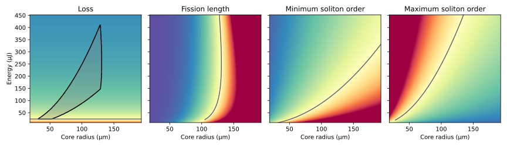
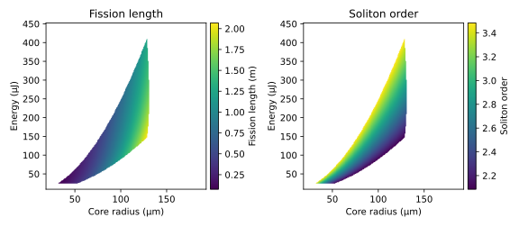

> [!WARNING]
> This package is a work in progress. Function signatures and internals are subject to change without notice. Please use with caution and contribute corrections or improvements if possible.

# HiSol.jl

**HiSol.jl** is a Julia package to aid in the design of gas-filled hollow-core fibre systems for pulse compression and soliton dynamics using ultrashort laser pulses. It does this by implementing a collection of design rules developed in the [Laboratory of Ultrafast Physics and Optics](https://lupo-lab.com).

HiSol.jl is based on analytical expressions for the various parameters involved in soliton dynamics (e.g. the phase-matching wavelength for RDW emission). Since soliton self-compression is a highly dynamical process, any analytical model is only approximate. Design parameters found with HiSol.jl should be checked with full numerical simulations, e.g. using [Luna.jl](https://github.com/LupoLab/Luna.jl), before basing experimental designs on them.

## Installation
HiSol.jl is not yet a registered Julia package. You therefore need to install it directly from GitHub, using the following commands in the Julia REPL:
```julia
] add https://github.com/LupoLab/HiSol.jl
```
**or**
```julia
using Pkg
Pkg.add(url="https://github.com/LupoLab/HiSol.jl")
```

## Basic usage
The main functionality of HiSol.jl is to find the parameter space for soliton self-compression and especially resonant dispersive wave (RDW) emission in gas-filled hollow capillary fibres. The main function which shows the available design space is `design_space_a_energy`. It requires 5 input arguments:
```julia
design_space_a_energy(λ_target, gas, λ0, τfwhm, maxlength)
```
- `λ_target::Number`: the target wavelength for RDW emission in metres.
- `gas::Symbol`: the gas species.
- `λ0::Number`: the pump/driving wavelength in metres.
- `τfwhm::Number`: the pump/driving pulse duration in seconds
- `maxlength::Number`: the maximum **total** length of the HCF system in metres.

As an example, we will design the HCF system used in the first demonstration of RDW emission in a hollow capillary fibre [Travers et al., Nature Photonics 13, 547 (2019)]. First we need to load the package and define our fixed parameters and constraints, then we call the function.

````julia
using HiSol;

λ_target = 160e-9 # 160 nm RDW
gas = :He # helium gas
λ0 = 800e-9 # 800 nm driving pulse
τfwhm = 10e-15 # 10 fs driving pulse
maxlength = 5 # 5 m maximum setup length

figs, params, as, energies, ratios = design_space_a_energy(λ_target, gas, λ0, τfwhm, maxlength)
````

````
Precompiling HiSol...
  38589.0 ms  ✓ Luna
   9693.5 ms  ✓ HiSol
  2 dependencies successfully precompiled in 51 seconds. 260 already precompiled.
sys:1: UserWarning: No contour levels were found within the data range.

````

This will produce the following plots (the `Figure` objects are returned in the `figs` variable above.)



The top row of plots shows parameter ratios which correspond to the four criteria we need to fulfill to observe RDW emission
- Loss: the fission length needs to be shorter than the $1/e$ loss length of the capillary. Equivalently, we need $\frac{L_\mathrm{fiss}}{L_\mathrm{loss}} < 1$.
- Fission length: the fission length needs to be shorter than the maximum capillary length which can fit into the available space for these parameters: $\frac{L_\mathrm{fiss}}{L_{\mathrm{HCF}}} < 1$.
- Minimum soliton order: for any soliton self-compression to occur, we need $N \geq 1.5$. Additionally, for RDWs far away from the pump wavelength (i.e. very short RDW wavelengths), we need $N \geq N_\mathrm{min}$ where the minimum soliton order $N_\mathrm{min}$ is based on an empirical relation. The relevant ratio is thus $\frac{N_\mathrm{min}}{N} < 1$.
- Maximum soliton order: we must not exceed the maximum soliton order, which encodes intensity limits due to photoionisation and plasma or self-focusing: $\frac{N}{N_\mathrm{max}} < 1$.

In each plot, the grey line shows the boundary between regions where the respective ratio is above and below $1$. The first plot also shows the resulting design space: the region where all four ratios are below $1$, and thus RDW emission should be possible.

The second figure shows the two key parameters for the soliton dynamics&mdash;the fission length and the soliton order&mdash;within the design space outlined by the four criteria.

To be more precise in our choices, instead of reading numbers off of the plot, we can use the `params` function returned by `design_space_a_energy`. This takes the two coordinates of the figure (core radius, pulse energy) and returns a full list of the specifications of the system. For example, we can find the exact configuration for a 125 μm core radius and 200 μJ:

````julia
a = 125e-6 # 125 μm
energy = 200e-6 # 200 μJ
p = params(a, energy)
````

````
(radius = 0.000125, density = 1.7914408055571105e25, pressure = 0.7253185622214363, intensity = 7.535276434231073e17, flength = 2.8737700334469096, energy = 0.0002, τfwhm = 1.0e-14, N = 2.5016708999581865, Nmin = 2.0856934877556217, Nmax = 3.4849157606268664, Lfiss = 1.6345326571134293, Lloss = 7.059317026423643, Isupp = 1.4622559752929698e19, Icrit = 1.5677245191881308e19)
````

Here `p` is now a `NamedTuple` containing the parameters. Its fields are:
- `radius`: (input) the chosen core radius.
- `energy`: (input) the chosen pulse energy.
- `density`: gas density (m⁻³).
- `pressure`: pressure (bar).
- `Lfiss`: fission length.
- `N`: soliton order.
- `flength`: *maximum* fibre length which fits into the space for the chosen parameters.
- `τfwhm`: FWHM pulse duration.
- `Nmin`: minimum soliton order.
- `Nmax`: maximum soliton order.
- `Lloss`: loss length of the HCF.
- `Isupp`: barrier suppression intensity of the filling gas.
- `Icrit`: critical intensity for self-focusing, calculated as $I_\mathrm{crit} = P_\mathrm{crit}/A_\mathrm{eff}$, where $P_\mathrm{crit}$ is the critical *power* and $A_\mathrm{eff}$ is the effective area of the waveguide.
- `intensity`: peak intensity of the driving pulse (W/m²), calculated as $P_0/A_\mathrm{eff}$ where $P_0$ is the pulse peak power.

To find, for example, the gas pressure for one point in the design space, we can access the respective field:

````julia
p.pressure
````

````
0.7253185622214363
````

Or, similarly, the fission length:

````julia
p.Lfiss
````

````
1.6345326571134293
````

## Additional options
The `design_space_a_energy` function takes a large range of additional keyword arguments which affect the design rules it applies. The two main categories concern a) safety factors for the nonlinear dynamics themselves b) limitations on the maximum HCF length in the given space (`maxlength`).

### Safety factors
The three main keyword arguments which affect the "safety margin" in the calculations control safety factors. For each safety factor, a *larger* number implies a *more conservative* rule, which implies a smaller design space.
- `S_sf`: safety factor on the critical power for self-focusing. The driving-pulse peak power will not exceed $P_\mathrm{crit}/S_\mathrm{sf}$. (Default: 5)
- `S_ion`: safety factor on strong-field photoionisation. The driving-pulse intensity (in the mode-averaged sense, i.e. $P_0/A_\mathrm{eff}$) will not exceed $I_\mathrm{supp}/S_\mathrm{ion}$, where $I_\mathrm{supp}$ is the barrier suppression intensity of the gas. (Default: 10)
- `S_fiss`: safety factor on the fission length. The *minimum* fibre length for efficient RDW emission is taken to be $S_\mathrm{fiss}L_\mathrm{fiss}$, where $L_\mathrm{fiss}$ is the fission length. (Default: 1.5)

`S_fiss` affects both the loss cut-off and the length cut-off: for a parameter combination to be included in the design space, $S_\mathrm{fiss}\times L_\mathrm{fiss}$ needs to be shorter than both the maximum HCF length *and* the loss length. A fourth keyword argument can alter that behaviour:

- `S_loss`: safety factor on the loss length. The fission length (multiplied by the safety factor) will be shorter than $L_\mathrm{loss}/S_\mathrm{loss}$. (Default: 1)

Note that `S_loss` follows the same convention as the other safety factors: a larger value results in a more conservative design rule.

The default safety factors are intentionally very conservative, with the aim of generating parameter combinations which are very likely to work in practice. In extreme cases, it can be necessary to adjust the safety factors. For example, RDW emission at very short wavelengths is commonly ionisation-limited. To achieve efficient frequency conversion, the conservative limit can be exceeded by several times&mdash;at the cost of relying on more extreme nonlinear dynamics which can be more sensitive to minor perturbations. Similarly, the loss limit can be exceeded (see e.g. Chen *et al.*, 10.1364/OL.553345) at the cost of a potentially significant reduction in conversion efficiency to the RDW.

### Maximum HCF length
> [!NOTE]
> This part of HiSol.jl is currently being re-developed to be more flexible. The API will change in the near future.

Because capillary fibres need to be kept perfectly straight, the maximum HCF length is determined by the available straight length of optical table. In most cases, space is required on both sides of the HCF to allow the incoming/outgoing beam to converge/diverge without being detrimentally affected by nonlinearities (in windows) or damaging the steering and focusing optics.

---

*This page was generated using [Literate.jl](https://github.com/fredrikekre/Literate.jl).*

